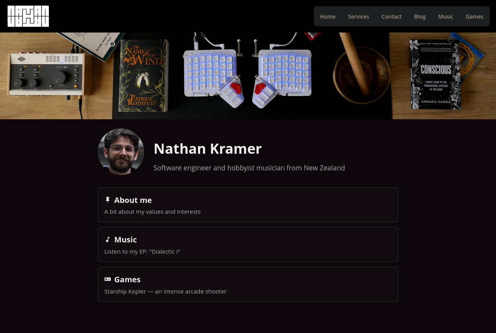

# nathankramer.dev

My personal website — [nathankramer.dev](https://nathankramer.dev). 



Built with [Astro](https://astro.build) and Tailwind CSS, deployed on Netlify.

## Layout

```
├── netlify/functions/   # Steam leaderboard proxy for the Starship Kepler page
├── public/              # Static assets, incl. Prism.js for syntax highlighting
├── src/
│   ├── components/      # Card.astro, BlogCard.astro
│   ├── content/blog/    # Blog posts as markdown (schema in content/config.ts)
│   ├── layouts/         # Layout.astro (base + nav), BlogPost.astro
│   └── pages/           # Routes; languages/ and problems/ are generated
└── generate.py          # Builds the Exercism pages from local solutions
```

## Commands

All commands are run from the root of the project, from a terminal:

| Command                | Action                                             |
| :--------------------- | :------------------------------------------------- |
| `npm install`          | Installs dependencies                              |
| `npm run dev`          | Starts local dev server at `localhost:4321`        |
| `npm run build`        | Build the production site to `./dist/`             |
| `npm run preview`      | Preview the build locally, before deploying        |
| `npm run astro ...`    | Run CLI commands like `astro add`, `astro preview` |
| `npm run astro --help` | Get help using the Astro CLI                       |

Reminder for my future self: to regenerate the Exercism pages, point `EXERCISM_DIR` at local Exercism
solutions and run:

```bash
python3 ./generate.py
```
